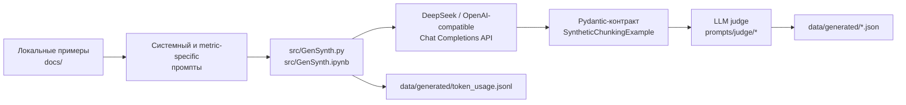

# Synthetic Document Chunks Generation

Исследовательский проект для генерации синтетических русскоязычных документов и
контрастных пар чанков. Каждая пара содержит:

- `positive` — разбиение с ожидаемо более высоким качеством;
- `negative` — почти такое же разбиение с одним контролируемым ухудшением;
- описание сделанного изменения и области, которую оно затрагивает.

Такие пары нужны, чтобы проверять поведение метрик чанкинга на понятных примерах:
если границу намеренно сдвинули внутрь условия или объединили две разные темы,
релевантная метрика должна измениться в ожидаемую сторону. Это не размеченный
эталон с заранее известными численными score, а набор исследовательских гипотез
в форме воспроизводимых входных данных.

> Сейчас этот репозиторий отвечает за **генерацию пар**. Готового pipeline для
> вычисления и сравнения метрик `chunking-metrics` здесь нет.

## Как всё связано



1. [`prompts/system.md`](prompts/system.md) задаёт общий формат контрастной
   пары и требования к синтетическому юридическому тексту.
2. Один из файлов в [`prompts/metrics/`](prompts/metrics/) задаёт конкретное
   контролируемое ухудшение.
3. [`src/GenSynth.py`](src/GenSynth.py) или
   [`src/GenSynth.ipynb`](src/GenSynth.ipynb) отправляет промпты модели и
   валидирует ответ по Pydantic-схеме `SyntheticChunkingExample` из
   [`src/PydanticContracts.py`](src/PydanticContracts.py).
4. LLM judge проверяет пример по общему prompt из
   [`prompts/judge/system.md`](prompts/judge/system.md), metric-specific prompt
   из [`prompts/judge/`](prompts/judge/) и Pydantic-контракту результата для
   соответствующей метрики.
5. В `data/generated/<имя_промпта>.json` сохраняются только пары, которые прошли
   judge. Журнал использования токенов дописывается в
   `data/generated/token_usage.jsonl`.

Материалы из `docs/` служат ориентирами при разработке промптов и не добавляются
в API-запрос автоматически.

Исходные примеры преимущественно имитируют структуру русскоязычных уставов:
нумерацию, заголовки, списки, условия, исключения, определения и ссылки между
пунктами. Все новые документы должны оставаться вымышленными. Они не являются
действующими юридическими документами или юридической консультацией.

## Быстрый старт

### 1. Подготовить окружение

Нужны Python 3.10 или новее и [uv](https://docs.astral.sh/uv/). Зависимость
`chunking-metrics` подключена в editable-режиме по относительному пути, поэтому
рядом с этим репозиторием должен находиться checkout
`DocumentChunkingMetricsFramework`:

```text
Work/
├── DocumentChunkingMetricsFramework/
└── SyntheticDocChunksGeneration/
```

Из корня этого проекта выполните:

```bash
uv sync --locked
cp .env.example .env
```

Если соседнего checkout нет, `uv sync` не сможет разрешить локальную зависимость
`../DocumentChunkingMetricsFramework`.

### 2. Настроить API

Заполните в `.env` переменную, которую читает генератор:

```dotenv
API_KEY=your_deepseek_api_key
```

Секреты из `.env` не должны попадать в систему контроля версий.

По умолчанию используется DeepSeek через OpenAI-compatible Chat Completions API:

```python
MODEL_NAME = "deepseek-v4-flash"
BASE_URL = "https://api.deepseek.com"

JUDGE_MODEL_NAME = "deepseek-v4-pro"
JUDGE_BASE_URL = "https://api.deepseek.com"
```

Для другого провайдера потребуется указать совместимые `MODEL_NAME`, `BASE_URL`,
`JUDGE_MODEL_NAME` и `JUDGE_BASE_URL`, а при необходимости адаптировать
provider-specific параметры запроса в [`src/GenSynth.py`](src/GenSynth.py).

### 3. Запустить генерацию

Генерацию можно запускать как Python-скрипт:

```bash
uv run python src/GenSynth.py
```

Также доступен notebook [`src/GenSynth.ipynb`](src/GenSynth.ipynb). В
зависимостях проекта установлен Jupyter kernel, но не JupyterLab или Notebook
server. Откройте notebook в IDE с поддержкой ноутбуков и выберите
интерпретатор `.venv/bin/python` как kernel.

Перед запуском отредактируйте конфигурацию в `src/GenSynth.py` или
соответствующей ячейке notebook:

| Параметр | Текущее значение по умолчанию | Назначение |
| --- | --- | --- |
| `MODEL_NAME` | `"deepseek-v4-flash"` | Модель генератора |
| `BASE_URL` | `"https://api.deepseek.com"` | OpenAI-compatible endpoint генератора |
| `TEMPERATURE` | `1.0` | Вариативность генерации |
| `MAX_TOKENS` | `(8192, 10000)[REASONING]` | Максимальный размер ответа генератора |
| `PAIRS_PER_PROMPT` | `30` | Количество judge-approved пар для каждого выбранного промпта |
| `REGENERATION_ATTEMPTS` | `20` | Число попыток генератора для одной пары |
| `JUDGE_MODEL_NAME` | `"deepseek-v4-pro"` | Модель judge |
| `JUDGE_TEMPERATURE` | `0.0` | Вариативность judge |
| `JUDGE_REGENERATION_ATTEMPTS` | `20` | Число попыток получить валидный JSON verdict |
| `USE_JUDGE_FEEDBACK_ON_EVEN_ATTEMPTS` | `True` | Исправлять отклонённый пример на чётных попытках |
| `SELECTED_PROMPTS` | список `(Path, JudgeResult)` | Сценарии, которые будут сгенерированы |

Каждый выбранный сценарий создаёт отдельный JSON-файл в `data/generated/`.
Каталог исключён из Git, потому что содержит локальные результаты генерации.

Повторный запуск не начинает файл заново. Генератор загружает сохранённый
JSON-массив и продолжает с первой недостающей пары: если сохранено 16 примеров,
следующим будет сгенерирован пример 17. Если в файле уже больше примеров, чем
`PAIRS_PER_PROMPT`, запуск падает с ошибкой. Сохранение после каждой принятой
пары оставляет частичный результат, если один из следующих запросов завершится
ошибкой.

Если `USE_JUDGE_FEEDBACK_ON_EVEN_ATTEMPTS = True`, чётные попытки исправляют
непосредственно предыдущий пример, отклонённый judge, с учётом полного verdict и
[`prompts/judge_feedback.md`](prompts/judge_feedback.md). Нечётные попытки
начинают генерацию с исходных `system`- и `user`-сообщений. Ошибка JSON-схемы не
создаёт feedback-контекст для следующей попытки; история нескольких отказов не
накапливается.

Учитывайте лимиты, стоимость API и недетерминированность модели. Каждый ответ
генератора и judge дописывает запись об использовании токенов в
`data/generated/token_usage.jsonl`, если SDK вернул usage metadata.

## Сценарии генерации

| Промпт | Контролируемое различие между `positive` и `negative` |
| --- | --- |
| `general_validation` | Две или три ошибки границ/группировки для общей проверки |
| `size_compliance` | Выход целевого чанка за заданный диапазон длины |
| `intrachunk_cohesion` | Объединение фрагментов двух разных тем |
| `contextual_coherence` | Попадание фрагмента соседнего раздела в целевой чанк |
| `boundary_clarity` | Сдвиг границы внутрь связанной смысловой единицы |
| `chunk_score` | Одна граница одновременно ухудшает законченность чанка и ясность перехода |
| `hope_concept_unity` | Добавление самостоятельного концепта в целевой чанк |
| `hope_semantic_independence` | Отделение контекста, без которого чанки нельзя понять независимо |
| `hope_information_preservation` | Потеря или минимальное искажение одного проверяемого факта |

Для большинства специализированных сценариев исходный текст двух вариантов
обязан совпадать: меняются только границы или группировка. Исключение —
`hope_information_preservation`, где `negative` намеренно теряет либо искажает
ровно один факт. Точные правила находятся в соответствующих файлах
[`prompts/metrics/`](prompts/metrics/), а правила judge — в зеркальной структуре
[`prompts/judge/metrics/`](prompts/judge/metrics/).

## Формат результата

Каждый файл `data/generated/<имя_промпта>.json` — массив объектов, прошедших
Pydantic-валидацию `SyntheticChunkingExample` и LLM judge:

```json
{
  "document_title": "Название вымышленного документа",
  "source_document": "Исходный синтетический текст",
  "positive": {
    "chunks": ["..."]
  },
  "negative": {
    "chunks": ["..."]
  },
  "controlled_change": "Единственное намеренное различие",
  "contrast_rationale": "Почему positive ожидаемо лучше negative",
  "evaluation_context": null
}
```

- `source_document` — текст, из которого построены варианты.
- `chunks` — итоговое разбиение документа.
- `controlled_change` — минимальное вмешательство, изолирующее проверяемое
  свойство.
- `contrast_rationale` — качественное объяснение, почему релевантный показатель
  для `positive` ожидаемо выше, чем для `negative`; это не результат измерения.
- `evaluation_context` — необязательные входные условия оценки. Если поле
  задано, Pydantic-контракт `EvaluationContext` требует ровно один из трёх
  вариантов: `length_range_chars`, `cue_question` или `fact`.

`length_range_chars` содержит `min` и `max`, причём `min` не может превышать
`max`. `cue_question` используется для HOPE Semantic Independence, `fact` — для
HOPE Information Preservation, `length_range_chars` — для Size Compliance. Для
остальных сценариев `evaluation_context` можно опустить или передать `null`.

Целевые чанки и границы не дублируются индексами: judge определяет их по
фактическому различию `positive.chunks` и `negative.chunks`. Маркер `||` внутри
текста соединяет логически связанные части одного чанка, например вводную фразу
списка и отдельный пункт.

### Judge verdict

Judge возвращает JSON, который валидируется одной из моделей
`*JudgeResult` из [`src/PydanticContracts.py`](src/PydanticContracts.py):

- `GeneralJudgeResult`;
- `SizeComplianceJudgeResult`;
- `IntrachunkCohesionJudgeResult`;
- `ContextualCoherenceJudgeResult`;
- `BoundaryClarityJudgeResult`;
- `ChunkScoreJudgeResult`;
- `HopeConceptUnityJudgeResult`;
- `HopeSemanticIndependenceJudgeResult`;
- `HopeInformationPreservationJudgeResult`.

Общий контракт verdict содержит `valid`, `quality_score`, список `issues`,
metric-specific `checks` и текстовое поле `reason`. В выходной JSON попадает не
verdict, а исходный пример генератора, только если `valid = true`.

### Token usage

`data/generated/token_usage.jsonl` — append-only JSONL-журнал. Каждая строка
описывает один полученный ответ API и включает `run_id`, prompt, номер пары,
роль (`generator` или `judge`), попытки, модель, endpoint, параметры reasoning,
результат обработки и поле `usage`. Если провайдер не вернул usage metadata,
`usage_available` будет `false`, а `usage` — `null`.

В [`src/TokenUsage.py`](src/TokenUsage.py) есть функции `load_token_usage()` и
`summarize_token_usage()` для загрузки журнала и агрегации токенов по запуску,
роли и конфигурации модели.

## Структура проекта

```text
.
├── docs/
│   ├── Examples.md              # положительные и отрицательные примеры чанков
│   └── Charter1/                # PDF, OCR JSON и извлечённый текст
├── prompts/
│   ├── system.md                # общий контракт генерации
│   ├── general_validation.md    # общий сценарий
│   ├── judge/                   # общие и metric-specific промпты judge
│   ├── judge_feedback.md        # инструкция исправления отклонённого примера
│   └── metrics/                 # специализированные сценарии генерации
├── src/
│   ├── GenSynth.py              # основной генерационный workflow
│   ├── GenSynth.ipynb           # notebook-версия генерационного workflow
│   ├── PydanticContracts.py     # контракты примера, evaluation_context и judge
│   ├── TokenUsage.py            # запись и агрегация token usage JSONL
│   └── UnitOCR.ipynb            # извлечение content из OCR JSON в текст
├── tests/
│   ├── test_contracts.py
│   ├── test_gensynth.py
│   └── test_token_usage.py
├── data/
│   ├── archive.zip              # локальный архив данных
│   ├── generated.zip            # локальный архив сгенерированных результатов
│   └── generated/               # локальные JSON/JSONL результаты, игнорируются Git
└── .env.example                 # шаблон API_KEY
```

[`docs/Examples.md`](docs/Examples.md) служит ориентиром по структуре и типовым
дефектам чанков. `UnitOCR.ipynb` — одноразовый вспомогательный workflow: он читает
`docs/Charter1/ocr.json`, собирает поля `content` и записывает
`docs/Charter1/ocr.txt`. Он не участвует в основном цикле генерации.

Файлы `data/generated/*.json` и `data/generated/token_usage.jsonl` создаются при
запуске генератора. Архивы `data/generated.zip` и `data/archive.zip` являются
локальными data artifacts.

## Проверка

```bash
uv run python -m unittest discover -s tests -v
```

Unit-тесты не проверяют внешний API. Они покрывают:

- Pydantic-контракты `SyntheticChunkingExample`, `EvaluationContext` и диапазона
  длины;
- resume генерации из уже сохранённого JSON-массива;
- запись, загрузку и сводку `token_usage.jsonl`.

Для реальной генерации дополнительно нужно вручную проверить хотя бы следующие
инварианты:

- `positive` и `negative` непустые и различаются только заявленным способом;
- `evaluation_context` присутствует только там, где он требуется сценарием, и
  соответствует исходному документу;
- при требовании одинакового исходного текста не потеряны и не добавлены фрагменты;
- `contrast_rationale` не выдаёт ожидаемое направление за уже измеренный score;
- в синтетическом тексте нет реальных персональных или регистрационных данных.

## Текущие ограничения

- Генерация и judge зависят от внешнего API и могут давать разные результаты при
  тех же настройках.
- LLM judge снижает риск невалидных примеров, но не заменяет ручную проверку
  исследовательского датасета.
- Точные численные значения метрик и универсальные пороги не генерируются:
  результат фиксирует только ожидаемое направление сравнения.
- Поддержка другого провайдера зависит от совместимости его Chat Completions API
  с используемыми параметрами запроса.
