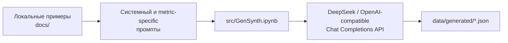

# Synthetic Document Chunks Generation

Исследовательский проект для генерации синтетических русскоязычных документов и
контрастных пар чанков. Каждая пара содержит:

- `positive` — разбиение с ожидаемо более высоким качеством;
- `negative` — почти такое же разбиение с одним контролируемым ухудшением;
- описание сделанного изменения и области, которую оно затрагивает.

Такие пары нужны, чтобы проверять поведение метрик чанкинга на понятных примерах:
если границу намеренно сдвинули внутрь условия или объединили две разные темы,
релевантная метрика должна измениться в ожидаемую сторону. Это не размеченный
эталон с заранее известными численными score, а набор исследовательских гипотез
в форме воспроизводимых входных данных.

> Сейчас этот репозиторий отвечает за **генерацию пар**. Готового pipeline для
> вычисления и сравнения метрик здесь нет.

## Как всё связано



1. [`prompts/system.md`](prompts/system.md) задаёт общий формат контрастной
   пары и требования к синтетическому юридическому тексту.
2. Один из файлов в [`prompts/metrics/`](prompts/metrics/) задаёт конкретное
   контролируемое ухудшение.
3. [`src/GenSynth.ipynb`](src/GenSynth.ipynb) отправляет оба промпта модели,
   проверяет, что ответ является JSON, и повторяет запрос при ошибке.
4. После каждой успешно сгенерированной пары текущий список записывается в
   `data/generated/<имя_промпта>.json`.

Материалы из `docs/` служат ориентирами при разработке промптов и не добавляются
в API-запрос автоматически.

Исходные примеры преимущественно имитируют структуру русскоязычных уставов:
нумерацию, заголовки, списки, условия, исключения, определения и ссылки между
пунктами. Все новые документы должны оставаться вымышленными. Они не являются
действующими юридическими документами или юридической консультацией.

## Быстрый старт

### 1. Подготовить окружение

Нужны Python 3.10 или новее и [uv](https://docs.astral.sh/uv/). Зависимость
`chunking-metrics` подключена в editable-режиме по относительному пути, поэтому
рядом с этим репозиторием должен находиться checkout
`DocumentChunkingMetricsFramework`:

```text
Work/
├── DocumentChunkingMetricsFramework/
└── SyntheticDocChunksGeneration/
```

Из корня этого проекта выполните:

```bash
uv sync --locked
cp .env.example .env
```

Если соседнего checkout нет, `uv sync` не сможет разрешить локальную зависимость
`../DocumentChunkingMetricsFramework`.

### 2. Настроить API

Заполните в `.env` переменную, которую фактически читает текущий ноутбук:

```dotenv
API_KEY=your_deepseek_api_key
```

`DEEPSEEK_API_KEY` присутствует в `.env.example`, но текущая версия
`GenSynth.ipynb` её не читает. Секреты из `.env` не должны попадать в систему
контроля версий.

По умолчанию используется DeepSeek:

```python
MODEL_NAME = "deepseek-v4-pro"
BASE_URL = "https://api.deepseek.com"
```

Клиент работает через OpenAI-compatible Chat Completions API. Для другого
провайдера потребуется указать совместимые `MODEL_NAME` и `BASE_URL`, а при
необходимости адаптировать provider-specific параметры запроса в
[`src/generation_pipeline.py`](src/generation_pipeline.py).

### 3. Запустить генерацию

В зависимостях проекта установлен Jupyter kernel, но не JupyterLab или Notebook
server. Откройте `src/GenSynth.ipynb` в IDE с поддержкой ноутбуков и выберите
интерпретатор `.venv/bin/python` как kernel.

Рабочей директорией kernel должна быть папка `src`: это требуется для импорта
`generation_pipeline` и соответствует относительным путям вспомогательного
OCR-ноутбука.

Перед запуском отредактируйте конфигурационную ячейку:

| Параметр | Назначение |
| --- | --- |
| `MODEL_NAME`, `BASE_URL` | Модель и OpenAI-compatible endpoint |
| `TEMPERATURE` | Вариативность генерации |
| `MAX_TOKENS` | Максимальный размер ответа |
| `TIMEOUT_SECONDS` | Тайм-аут одного API-запроса |
| `PAIRS_PER_PROMPT` | Количество пар для каждого выбранного промпта |
| `REGENERATION_ATTEMPTS` | Число повторных попыток после ошибки |
| `SELECTED_PROMPTS` | Сценарии, которые будут сгенерированы |

Затем последовательно выполните обе ячейки ноутбука. Каждый выбранный сценарий
создаёт отдельный JSON-файл в `data/generated/`. Каталог исключён из Git, потому
что содержит локальные результаты генерации.

Повторный запуск сценария начинает его список заново: после первой новой пары
существующий файл будет перезаписан. Сохранение после каждой пары оставляет уже
полученный частичный результат, если один из следующих запросов завершится
ошибкой. Учитывайте лимиты, стоимость API и недетерминированность модели.

## Сценарии генерации

| Промпт | Контролируемое различие между `positive` и `negative` |
| --- | --- |
| `general_validation` | Две или три ошибки границ/группировки для общей проверки |
| `size_compliance` | Выход целевого чанка за заданный диапазон длины |
| `intrachunk_cohesion` | Объединение фрагментов двух разных тем |
| `contextual_coherence` | Попадание фрагмента соседнего раздела в целевой чанк |
| `boundary_clarity` | Сдвиг границы внутрь связанной смысловой единицы |
| `chunk_score` | Одна граница одновременно ухудшает законченность чанка и ясность перехода |
| `hope_concept_unity` | Добавление самостоятельного концепта в целевой чанк |
| `hope_semantic_independence` | Отделение контекста, без которого чанки нельзя понять независимо |
| `hope_information_preservation` | Потеря или минимальное искажение одного проверяемого факта |

Для большинства специализированных сценариев исходный текст двух вариантов
обязан совпадать: меняются только границы или группировка. Исключение —
`hope_information_preservation`, где `negative` намеренно теряет либо искажает
ровно один факт. Точные правила находятся в соответствующих файлах
[`prompts/metrics/`](prompts/metrics/).

## Формат результата

Каждый файл в `data/generated/` — массив объектов следующего вида:

```json
{
  "document_title": "Название вымышленного документа",
  "source_document": "Исходный синтетический текст",
  "positive": {
    "chunks": ["..."]
  },
  "negative": {
    "chunks": ["..."]
  },
  "controlled_change": "Единственное намеренное различие",
  "contrast_rationale": "Почему positive ожидаемо лучше negative",
  "evaluation_context": null
}
```

- `source_document` — текст, из которого построены варианты.
- `chunks` — итоговое разбиение документа.
- `controlled_change` — минимальное вмешательство, изолирующее проверяемое
  свойство.
- `contrast_rationale` — качественное объяснение, почему релевантный показатель
  для `positive` ожидаемо выше, чем для `negative`; это не результат измерения.
- `evaluation_context` — необязательные входные условия оценки. Он содержит только
  `length_range_chars` для Size Compliance, `cue_question` для HOPE Semantic
  Independence или `fact` для HOPE Information Preservation. Для остальных
  сценариев поле можно опустить или передать `null`.

Целевые чанки и границы не дублируются индексами: judge определяет их по
фактическому различию `positive.chunks` и `negative.chunks`. Маркер `||` внутри
текста соединяет логически связанные части одного чанка, например вводную фразу
списка и отдельный пункт.

Ответ модели считается пригодным для сохранения, если его можно разобрать как
JSON-объект. Семантическая корректность полей автоматически не валидируется,
поэтому сгенерированные пары необходимо просматривать перед использованием в
эксперименте.

## Структура проекта

```text
.
├── docs/
│   ├── Examples.md              # положительные и отрицательные примеры чанков
│   └── Charter1/                # PDF, OCR JSON и извлечённый текст
├── prompts/
│   ├── system.md                # общий контракт генерации
│   ├── general_validation.md    # общий сценарий
│   └── metrics/                 # специализированные сценарии
├── src/
│   ├── GenSynth.ipynb           # основной генерационный workflow
│   ├── UnitOCR.ipynb            # извлечение content из OCR JSON в текст
│   └── generation_pipeline.py   # запросы с retry и сохранение JSON
├── tests/
│   └── test_generation_pipeline.py
└── data/generated/              # локальные результаты, игнорируются Git
```

[`docs/Examples.md`](docs/Examples.md) служит ориентиром по структуре и типовым
дефектам чанков. `UnitOCR.ipynb` — одноразовый вспомогательный workflow: он читает
`docs/Charter1/ocr.json`, собирает поля `content` и записывает
`docs/Charter1/ocr.txt`. Он не участвует в основном цикле генерации.

## Проверка

Unit-тесты не обращаются к внешнему API: вместо него используется тестовый
клиент. Они проверяют контракт запроса, повторные попытки и сохранение читаемого
UTF-8 JSON.

```bash
uv run python -m unittest discover -s tests -v
```

Для реальной генерации дополнительно нужно вручную проверить хотя бы следующие
инварианты:

- `positive` и `negative` непустые и различаются только заявленным способом;
- `evaluation_context` присутствует только там, где он требуется сценарием, и
  соответствует исходному документу;
- при требовании одинакового исходного текста не потеряны и не добавлены фрагменты;
- `contrast_rationale` не выдаёт ожидаемое направление за уже измеренный score;
- в синтетическом тексте нет реальных персональных или регистрационных данных.

## Текущие ограничения

- Автоматическая проверка полной JSON-схемы и семантических инвариантов пока не
  реализована.
- Генерация зависит от внешнего API и может давать разные результаты при тех же
  настройках.
- Точные численные значения метрик и универсальные пороги не генерируются:
  результат фиксирует только ожидаемое направление сравнения.
- Поддержка другого провайдера зависит от совместимости его Chat Completions API
  с используемыми параметрами запроса.
